# Mastering Agentic AI with Langflow and Astra DB 🚀

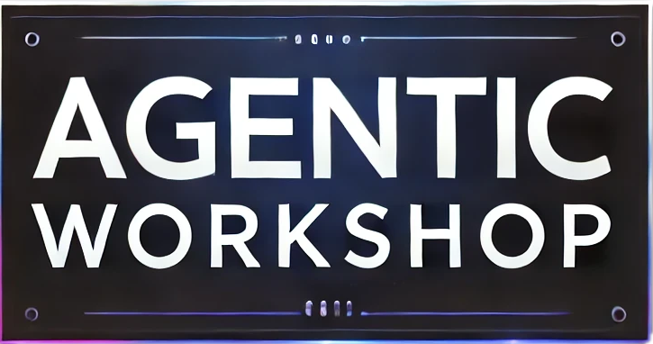

---

## Workshop Overview 🛠️✨

Welcome to this transformative workshop! Today, we’ll explore how to build an **Agentic AI Application** using **Langflow** and **Astra DB**. By the end of this workshop, you’ll have created a powerful customer support system capable of:

- **Handling FAQs** with contextual accuracy.
- **Processing customer orders** effortlessly.
- **Retrieving real-time product details** through seamless integrations.

### Key Technologies

- **[Langflow](https://www.langflow.org/)**: A low-code platform enabling drag-and-drop simplicity for AI workflows.
- **[Astra DB](https://www.datastax.com/products/datastax-astra)**: A vector-enabled database designed for real-time semantic search and advanced querying.

### What You’ll Learn:

- How to implement **retrieval-augmented generation (RAG)** for precise FAQ handling.
- Building **multi-agent systems** to tackle complex queries.
- Deploying an **AI-powered customer support agent** with a Streamlit front end.

Get ready to build scalable, real-world AI applications that make a difference.

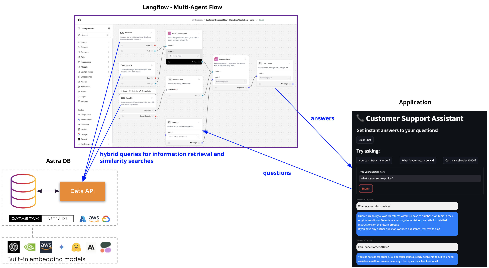

---

## Use Case: Empowering Customer Support with AI 🤝💡

### Why This Use Case Matters

E-commerce businesses face constant customer inquiries about:
- Shipping times
- Order statuses
- Product details

**Challenges**:
- Manual responses are time-consuming and prone to errors.
- Scaling support teams to meet demand is costly.

**Solution**:
An AI-driven customer support system can:
- **Efficiently answer FAQs** using retrieval-augmented generation.
- **Access real-time order and product data** from a centralized database.
- **Scale effortlessly** to handle high query volumes with minimal intervention.

---

## Workshop Goal 🎯

By the end of this workshop, you’ll build a system capable of:
1. **Answering FAQs** with RAG.
2. **Querying Orders** using Astra DB.
3. **Collaborating Agents** to address multi-faceted queries.

Let’s dive in!

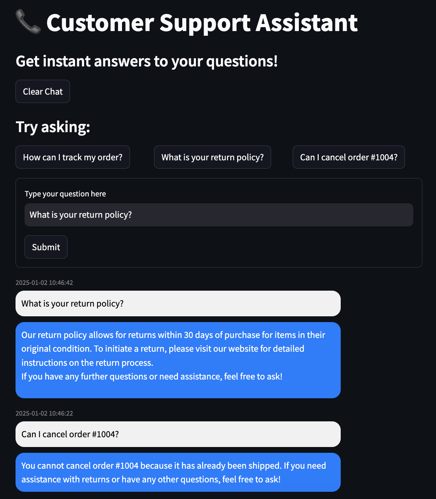

---

## Prerequisites ✅

This workshop assumes you have access to:
1. A **[GitHub account](https://github.com)**.
2. A paid **OpenAI account**. *(We will provide API keys if needed.)*

Additionally, create free accounts for:
- **Streamlit**: Follow the [quickstart guide](https://docs.streamlit.io/streamlit-community-cloud/get-started/quickstart).
- **Langflow**: [Sign up here](https://astra.datastax.com/signup?type=langflow).

---

## Let’s Make Magic Happen! 🦄✨

We’ll begin by implementing a multi-agent-based flow for our frontend application. This flow will be the backbone for delivering accurate and dynamic responses to customer inquiries.

---

### Step 1: **Set Up Our Flow** 🛠️🌟

Start by setting up a new flow in Langflow, the foundation for your project.

---

#### **Create a New Flow** ➕  
- Open [Langflow](https://astra.datastax.com/langflow) and click **New Flow** on the dashboard.  
- This will open the flow creation interface.  

   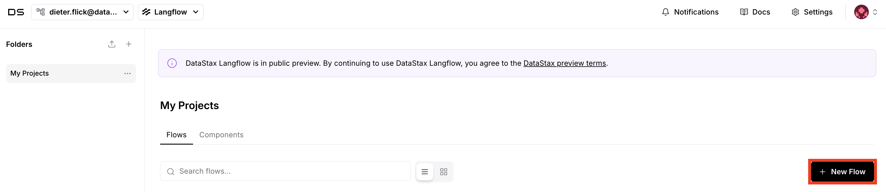

---

#### **Choose a Blank Flow Template** 📄  
- Select the **Blank Flow** option from the available templates.  
- Langflow offers a variety of templates for different AI workflows, which are continuously expanding.

   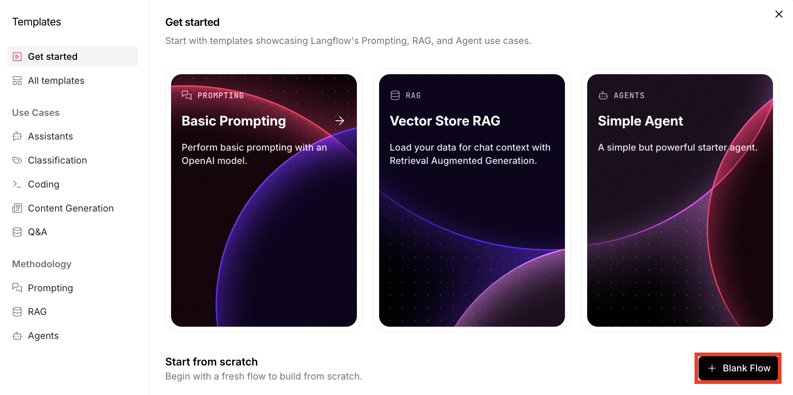

---

#### **Name Your Flow** ✏️  
- Click **Flow Settings** to configure the flow details.  

   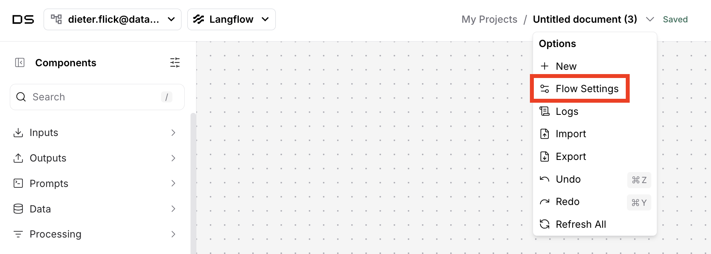

- Provide a meaningful name that reflects the flow's purpose.  
- Define the API endpoint to make the flow accessible via external HTTP calls.  

   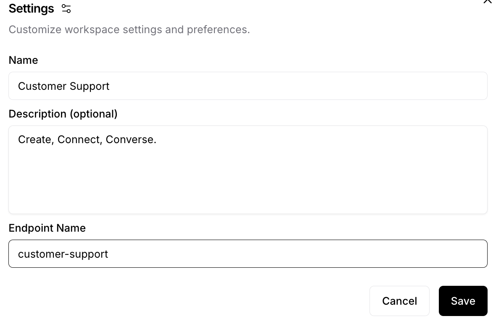

---

> **🎉 Success!** Your flow is now set up and ready for development. Next, create a simple echo flow to see how components interact.  

--- 

### Step 2: **Create a Simple Echo Flow** 🔁💬

Learn the basics of Langflow by creating a simple flow where the input is echoed back to the user. This exercise introduces the interface and demonstrates how components interact.

---

#### **Add Components** 🧩  
- Drag `Chat Input` and `Chat Output` components from the left-hand panel onto the canvas.  
- These components represent the user input and the system response.

---

#### **Connect the Components** 🔗  
- Link the `Chat Input` component to the `Chat Output` component.  
- This creates a direct flow, sending user input directly to the output.

   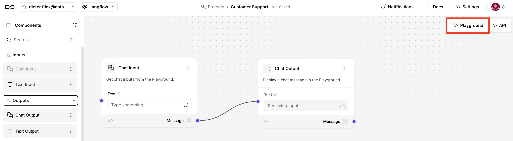

---

#### **Test in the Playground** 🎮  
- Click the **Playground** button to test the flow.  
- In the Playground, type:
   ```
   hello
   ```  
- Observe how the input is echoed back in the output.

   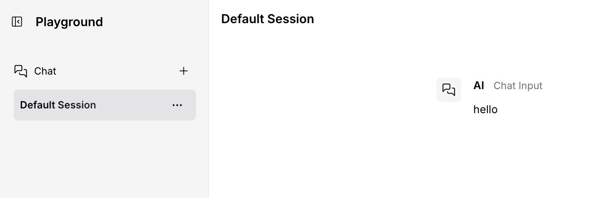

---

> **🎉 Success!** You’ve created your first flow in Langflow. This simple echo flow demonstrates how components interact. Next, extend this flow by introducing an agent to handle more complex tasks.  

---

### Step 3: **Extend the Flow with an Agent** 🤖💡

Extend your flow by integrating an agent to enable advanced capabilities. The agent will act as the brain behind your application, processing inputs and interacting with tools.

---

#### **Remove Existing Connections** ✂️  
- Disconnect the `Chat Input` and `Chat Output` components.

---

#### **Add an Agent Component** 🧩  
- Drag and drop the `Agent` component onto the canvas.

---

#### **Connect the Components** 🔗  
- Link the `Chat Input` component to the `Agent` component.  
- Connect the `Agent` component to the `Chat Output` component.

   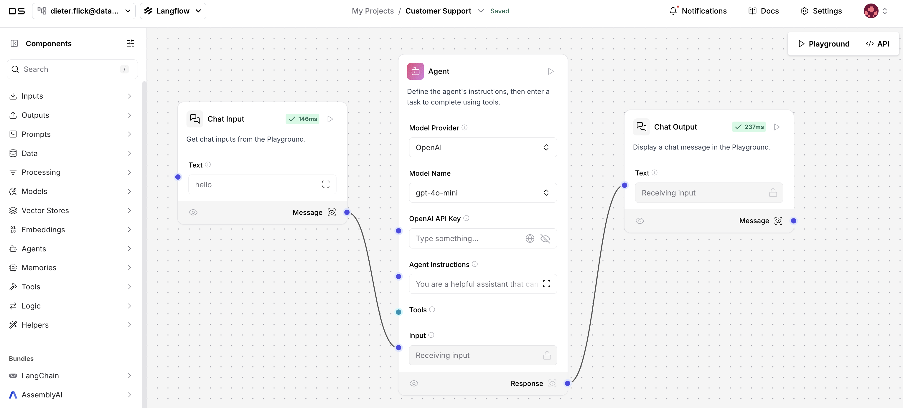

---

#### **Configure API Credentials** 🔑  
- The agent supports various LLM providers. For this workshop, we use OpenAI, which requires an API key.  
- Click the icon in the **OpenAI API Key** field of the agent.  
- Add a new variable of type **Credential**, name it `OPENAI_API_KEY`, and select the variable.

   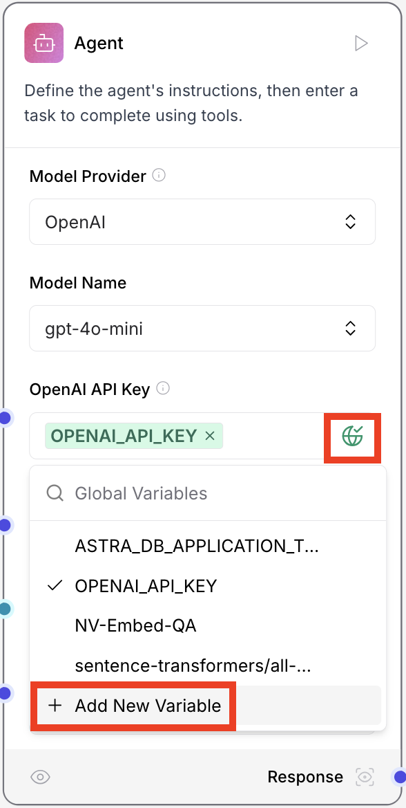

---

#### **Set Agent Instructions** 📜  
- Instructions guide the agent on what tasks to perform and how to interact with tools.  
- Click the icon in the **Agent Instructions** field to view the default instruction:
   ```
   You are a helpful assistant that can use tools to answer questions and perform tasks.
   ```
- For now, leave the default instruction unchanged.

---

#### **Test the Flow in the Playground** 🎮  
- Open the **Playground** and test the agent by entering a query like:
   ```
   Who is Bob Marley?
   ```
- Observe the agent's response and verify that it processes the input correctly.

   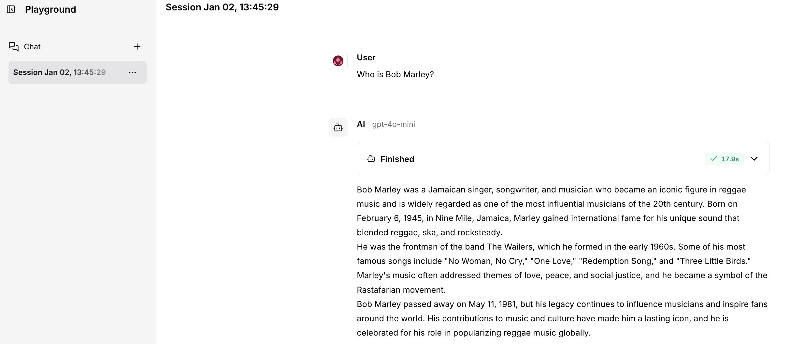

---

> **🎉 Success!** You’ve successfully integrated an agent into your flow. This is a key step toward creating a smart and interactive application. Next, we’ll tailor the agent for our specific use case: the "Customer Support Agent."  

---

### Step 4: **Implement the RAG Flow** 🔍📚

The agent we developed so far cannot answer questions specific to our context and may hallucinate, producing irrelevant or incorrect responses. To address this, we’ll implement a Retrieval-Augmented Generation (RAG) flow. This approach allows the agent to retrieve relevant data from the company’s FAQ database for accurate responses.

---

#### **Add an Astra DB Component** 🗄️  
- Drag an `Astra DB` component onto the canvas from the **Vector Stores** section. 
- Switch the `Astra DB` component into `Tool Mode`

   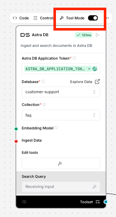
  
- Use this tool to retrieve vectorized FAQ data.
- This tool enables the agent to search the FAQ database for relevant information.

---

#### **Connect the Components** 🔗  
- Link the `Astra DB` tool to the `Agent` component.  

   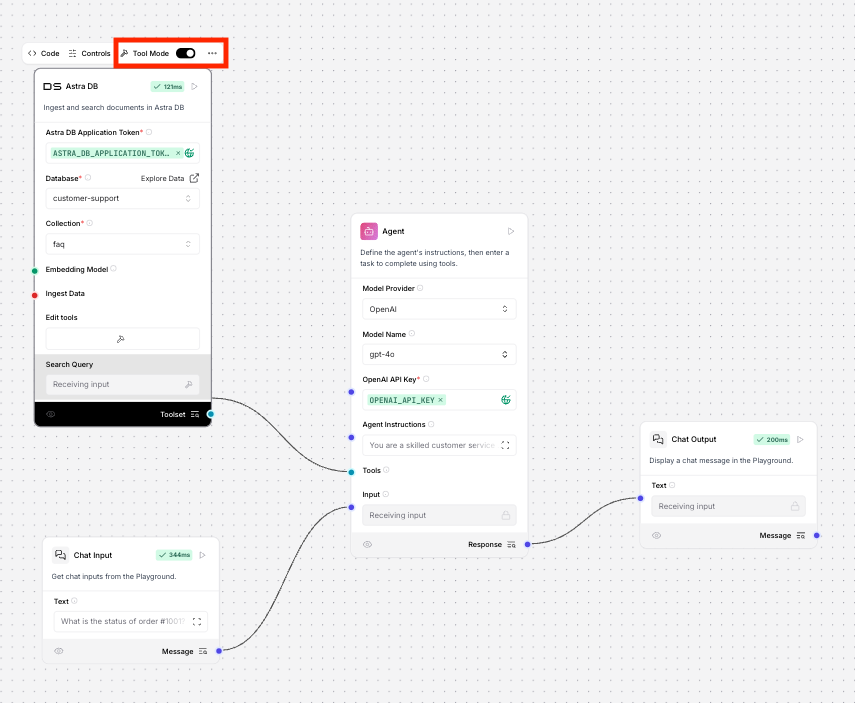

---

#### **Create a New Database in Astra DB** 📋  
- In the `Astra DB` component, click **Add New Database** to create a new database.

   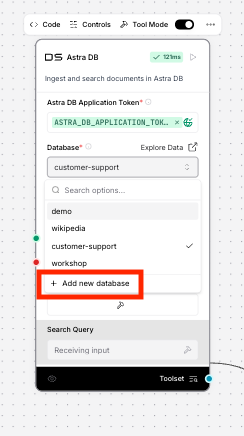

- Fill in the required details and click **Create Database**.

   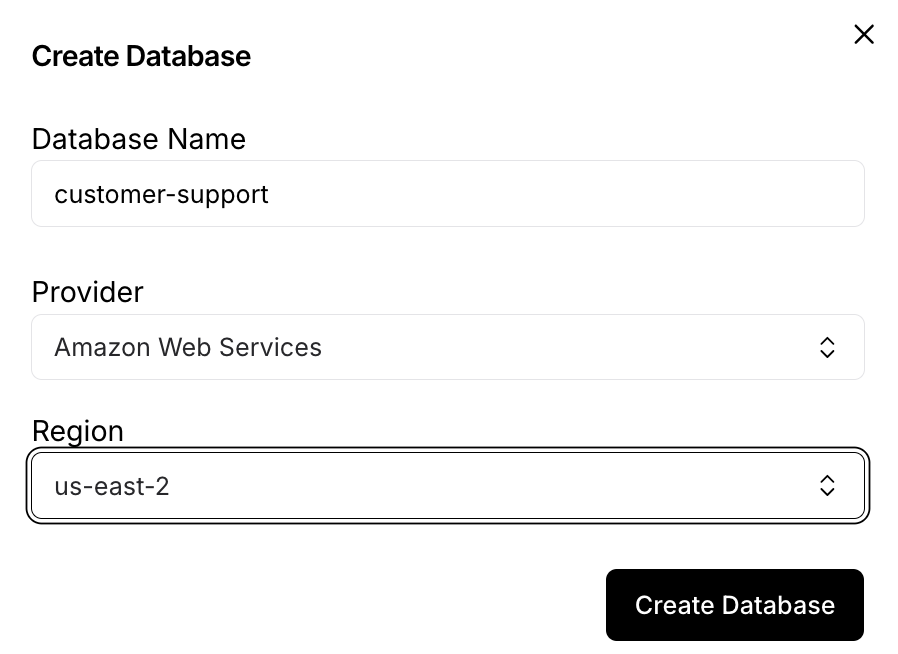

> **Note:** Database creation may take a few minutes.

---

#### **Switch to Astra DB** 🔄  
- Open Astra DB and navigate to your newly created database.

   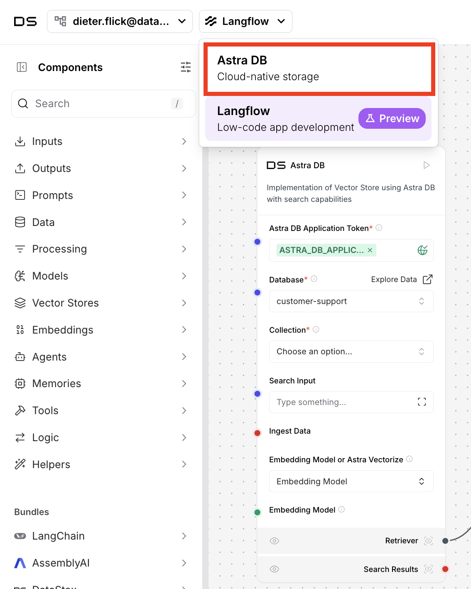

---

#### **Create an FAQ Collection** 🗂️  
- In Astra DB, go to **Data Explorer** and click **Create Collection**.

   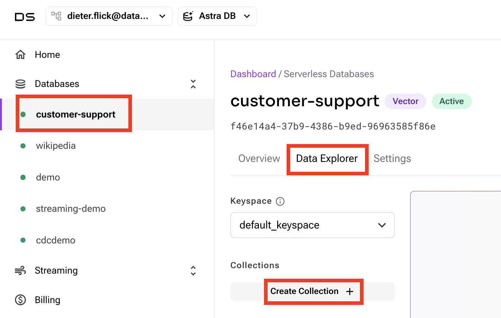

- Name the collection `faq`, enable the **Vector-Enabled Collection** option, and click **Create Collection**.

   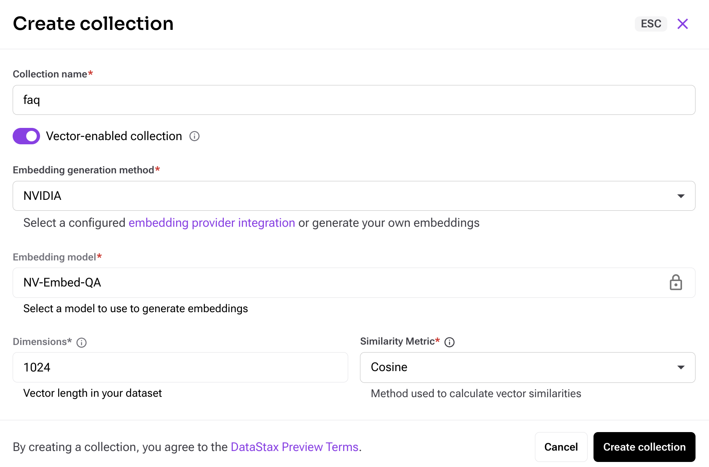

---

#### **Switch Back to Langflow** ↩️  
- Return to Langflow to continue configuring the RAG flow.

   

---

#### **Configure the Astra DB Component** ⚙️  
- Fill in the following details in the `Astra DB` component:
   - **Collection Name:** `faq`

   

- Extend the tool description. Click `Edit tools` and extend the `Tool Description` with: 
     ```text
     Answer frequently asked questions (FAQs) about shipping, returns, placing orders, and more.
     ```

   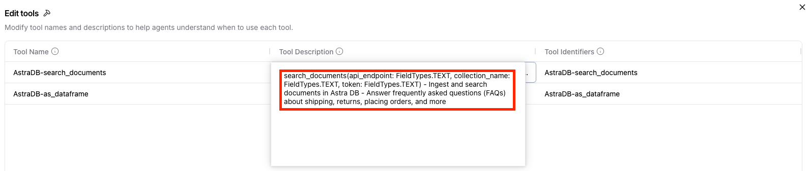

---

#### **Define Agent Instructions** ✍️  
- Add the following instructions to the **Agent Instructions** field:
   ```text
   Your primary responsibility is to use the available tools to accurately address user inquiries and provide detailed, helpful responses. You can:

   - Answer frequently asked questions (FAQs) about shipping, returns, placing orders, and more.

   Example: If the ask is about delivery times, check the FAQ.
   Always aim to deliver clear, concise, and user-focused solutions to ensure the best possible experience.
   ```

---

#### **Test the RAG Flow** 🎮  
- Open the **Playground** and test the flow with a query like:
   ```
   What are the shipping times?
   ```
- Observe the response to confirm the agent is unable to respond meaningfully.

   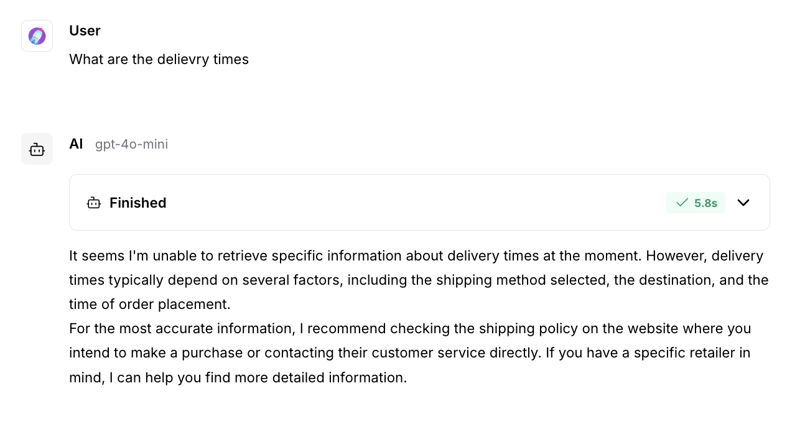

---

#### **Verify the Flow** ✅  
- **Test Point 1:** Observe that the agent is unable to respond meaningfully without context.

---

> **🎉 Success!** Your agent now includes a RAG flow to answer context-specific queries accurately. The foundation is laid—next, we’ll enrich the agent with the required FAQ data. Say goodbye to hallucinations and hello to reliable responses!  

---

### Step 5: **Vectorize the FAQ** 📚✨

The agent cannot yet provide proper answers because it lacks the necessary information from the FAQ. Although we have an FAQ collection in the database, it is currently empty. Let’s populate it using a vectorization flow in Langflow.

---

#### **Add Components to the Canvas** 🧩  
1. **File Component:**  
   - Drag a `File` component from the **Data** section.  
   - This will allow you to upload the `Company_FAQ.pdf`.  

2. **Split Text Component:**  
   - Drag a `Split Text` component from the **Processing** section.  
   - This will divide the FAQ into manageable chunks for vectorization.  

3. **Astra DB Component:**  
   - Drag an `Astra DB` component from the **Vector Stores** section.  
   - This will store the vectorized data.  

---

#### **Connect the Components** 🔗  
- Link the **File** component’s `Data` endpoint to the `Split Text` component’s `Data Inputs` endpoint.  
- Connect the `Chunks` output of the **Split Text** component to the `Ingest Data` endpoint of the **Astra DB** component.  

---

#### **Upload the FAQ Document** 📥  
- Upload the `Company_FAQ.pdf` file via the **File** component.  

---

#### **Configure the Astra DB Component** ⚙️  
- Fill in the following details:  
  - **Database Name:** `customer-support`  
  - **Collection Name:** `faq`  

---

#### **Run the Vectorization Flow** ▶️  
- Click the play button on the **Astra DB** component to execute the flow.  
- The PDF will be split into chunks, vectorized, and stored in Astra DB alongside their corresponding vectors.  

   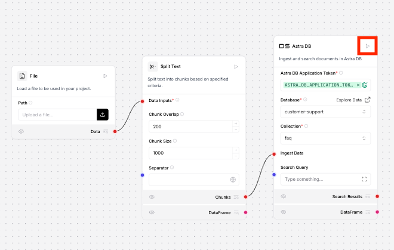

---

#### **Test in the Playground** 🎮  
- Open the **Playground** and query the system with:  
   ```
   What are the shipping times?
   ```  
- Confirm that the system retrieves accurate responses based on the newly vectorized FAQ data.  

   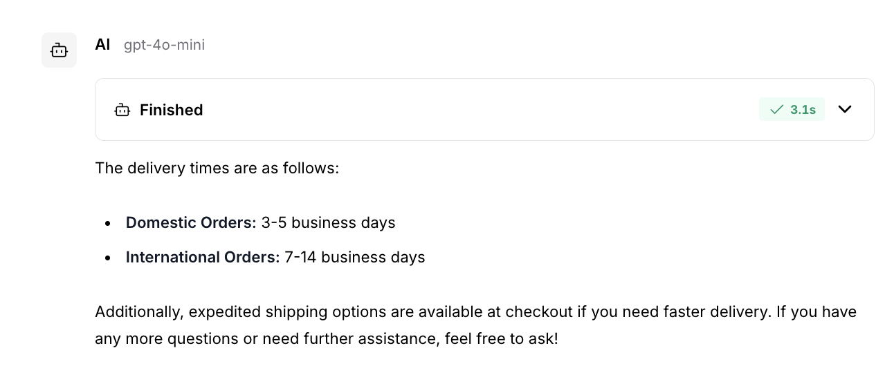

---

#### **Verify Vectorization** ✅  
- **Test Point 1:** Ensure the `faq` collection in Astra DB contains the vectorized data by querying it directly in Astra DB.  
- **Test Point 2:** Use queries like "What are the shipping times?" in the Langflow Playground to confirm the agent retrieves accurate information from the FAQ.  

---

> **🎉 Success!** Your FAQ has been successfully vectorized and integrated. The agent is now equipped to handle context-specific queries with precision.

---

### Step 6: **Upload Sample Data** 📦💾

Enable your customer support system to retrieve order and product details by uploading sample data to Astra DB.

---

#### **Switch to Astra DB** 🔄  
- Navigate from Langflow to Astra DB.

   

---

#### **Create the `Orders` Collection** 📝  
- In Astra DB, open your `customer-support` database and go to the **Data Explorer**.  
- Click **Create Collection** and configure:
  - **Collection Name:** `orders`  
  - Disable the **Vector-enabled collection** switch.  
  - Click **Create Collection**.  

   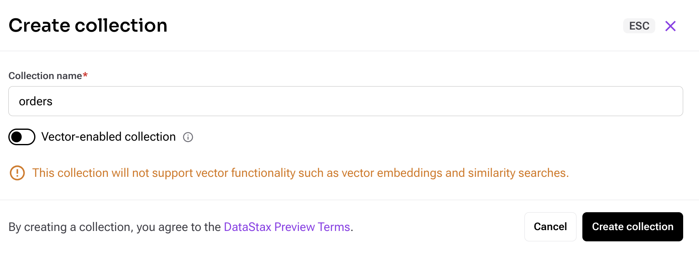

---

#### **Create the `Products` Collection** 🛒  
- Repeat the steps above to create another collection:  
  - **Collection Name:** `products`  
  - Disable the **Vector-enabled collection** switch.  
  - Click **Create Collection**.  

---

#### **Load Data into the Collections** 📥  
1. **Orders Collection:**  
   - Select the `orders` collection in the **Data Explorer**.  
   - Click **Load Data** and upload the file: [sample_orders.csv](./sample_orders.csv).  

   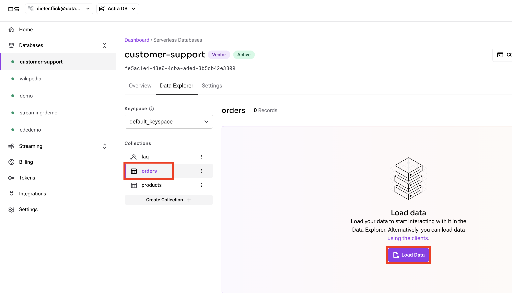
   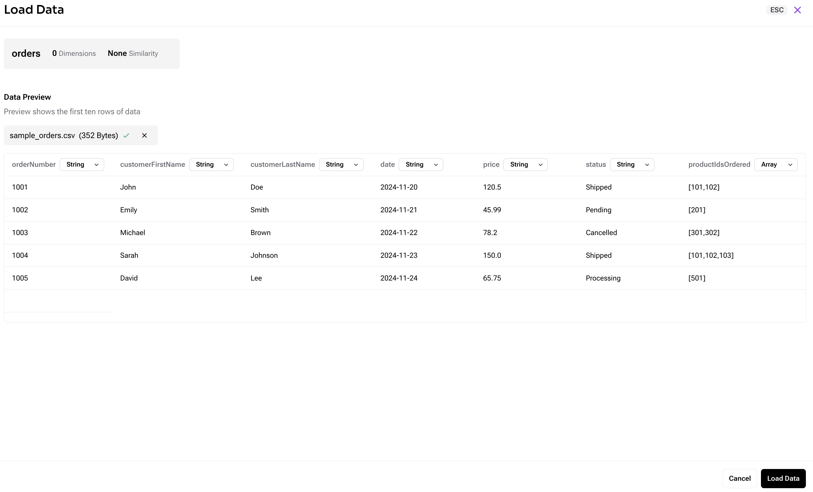

2. **Products Collection:**  
   - Select the `products` collection in the **Data Explorer**.  
   - Click **Load Data** and upload the file: [sample_products.csv](./sample_products.csv).  

---

#### **Verify Data Uploads** ✅  
- **Test Point 1:** Query the `orders` collection in Astra DB to ensure the data was uploaded correctly.  
- **Test Point 2:** Verify the `products` collection reflects the sample data.  

   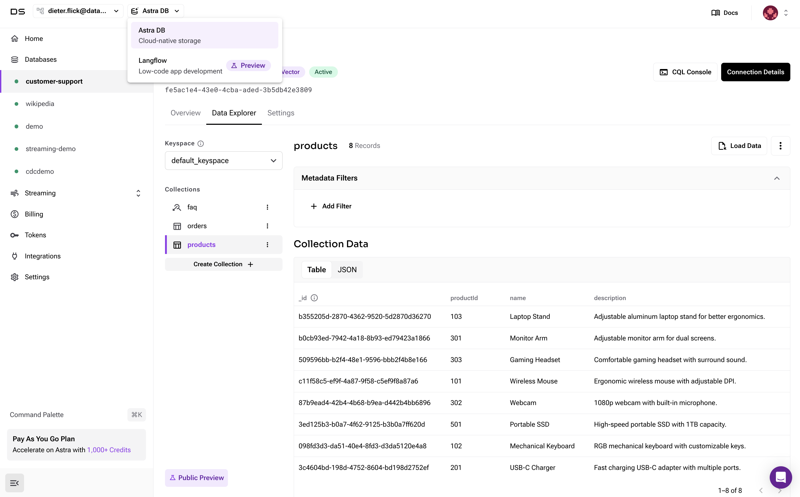

---

#### **Return to Langflow** 🔙  
- After completing the data uploads, switch back to Langflow to continue building your flows.  

   

---

> **🎉 Success!** Your sample data is now loaded into Astra DB, ready for integration with the `OrderLookupAgent` and other flows.
---

### Step 7: **Build the Order Lookup Agent Flow** 🛠️🔍

Create a flow that retrieves order details and related product information from the database, enabling your customer support system to address queries effectively.

---

#### **Add Astra DB Components** 📦  
- Drag and drop an **Astra DB** component for the `orders` collection:
  - **Tool Name:** `OrderLookup`  
  - **Database Name:** `customer-support`  
  - **Collection Name:** `orders`  
  - **Tool Description:** `A tool used to look up an order based on its ID.`  
  - **Tool Params:** `!orderNumber`  

- Drag and drop another **Astra DB** component for the `products` collection:
  - **Tool Name:** `ProductLookup`  
  - **Database Name:** `customer-support`  
  - **Collection Name:** `products`  
  - **Tool Description:** `A tool used to look up a product based on its ID.`  
  - **Tool Params:** `!productId`  

---

#### **Add an Agent Component** 🤖  
- Drag and drop an **Agent** component to act as the logic handler.  
- Configure the agent:
  - **OpenAI API Key:** Add your key.  
  - **Agent Instructions:**  
    ```text
    You are an expert in analyzing customer orders and providing detailed and accurate information. Your primary role is to utilize the provided tools to efficiently look up order numbers, retrieve relevant details about the orders, and address any questions or concerns the user may have.

    Lookup order numbers and product IDs using the tools provided.

    Orders always contain an array of product IDs. Use these IDs to look up the specific products from the product lookup tool and aggregate the product information with the order to provide a clear summary of the order.

    If the order does not exist, simply tell the user to try again as the ID wasn't found.

    Only return information about orders; do not return anything else.
    ```  
  - Enable **Tool Mode** and rename the agent to `OrderLookupAgent`.  

   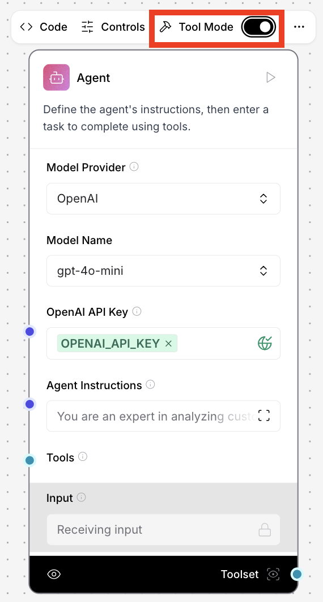

---

#### **Connect Components** 🔗  
- Connect the `Tool` endpoints of the `OrderLookup` and `ProductLookup` components to the `Tools` endpoint of the `OrderLookupAgent`.

---

#### **Validate the Flow** ✅  
- Click the **Play** button on the `OrderLookupAgent` to verify the flow is configured correctly.  

   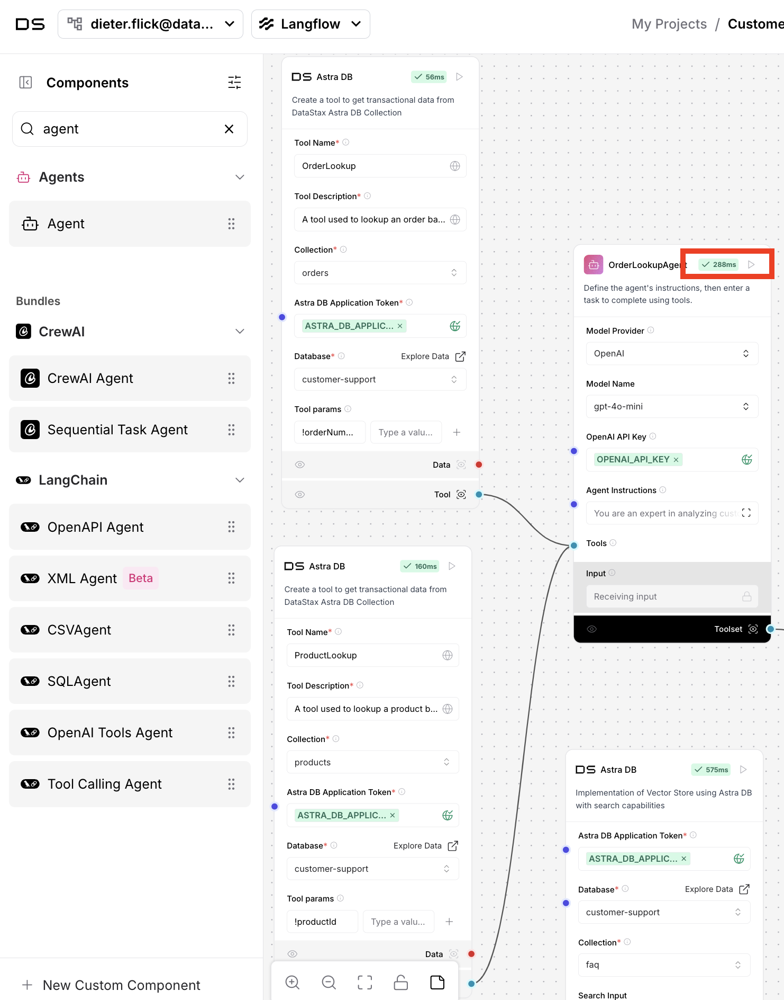

---

> **🎉 Congratulations!** You’ve successfully built an `OrderLookupAgent` that retrieves and combines order and product data from your Astra DB collections. This forms a vital component of your customer support system!

---

### Step 8: **Combine Both Flows with a Manager** 🛠️🤖

Integrate the **RAG Flow** and **Order/Product Lookup Flow** using a `ManagementAgent`. This agent will intelligently route user inquiries, leveraging both flows for accurate and complete responses.

---

#### **Rename the RAG Agent** ✏️  
Rename the existing RAG agent to `ManagementAgent` to reflect its new role as a central coordinator.

---

#### **Define ManagementAgent’s Role** 📜  
Provide the `ManagementAgent` with detailed instructions to guide its use of tools:  
```text
You are a skilled customer service manager and information router. Your primary responsibility is to use the available tools to accurately address user inquiries and provide detailed, helpful responses. You can:

- Look up order numbers to retrieve and share order details.
- Access product information to provide relevant descriptions or specifications.
- Answer frequently asked questions (FAQs) about shipping, returns, placing orders, and more.

If a query requires multiple tools, combine their outputs to deliver a comprehensive response.  
Example: For an inquiry about canceling an order, retrieve the order and product details, and also reference the FAQ for the cancellation policy.

Always aim to deliver clear, concise, and user-focused solutions to ensure the best possible experience.
```

---

#### **Connect Tools to ManagementAgent** 🔗  
- Link the `OrderLookupAgent` component’s `Toolset` endpoint to the `ManagementAgent` component’s `Tools` endpoint.

   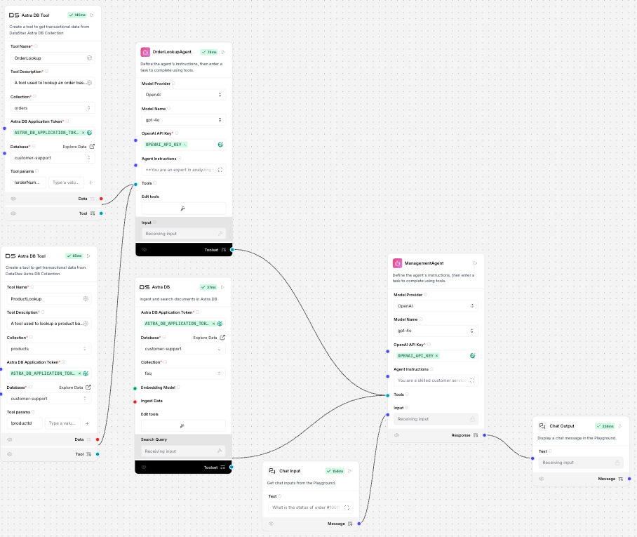

---

#### **Test in the Playground** 🎮  
- Click the **Playground** button and run this query:  
   ```
   What is the status of order #1001?
   ```  
- Verify the response combines relevant data from the `Orders` and `Products` collections.

   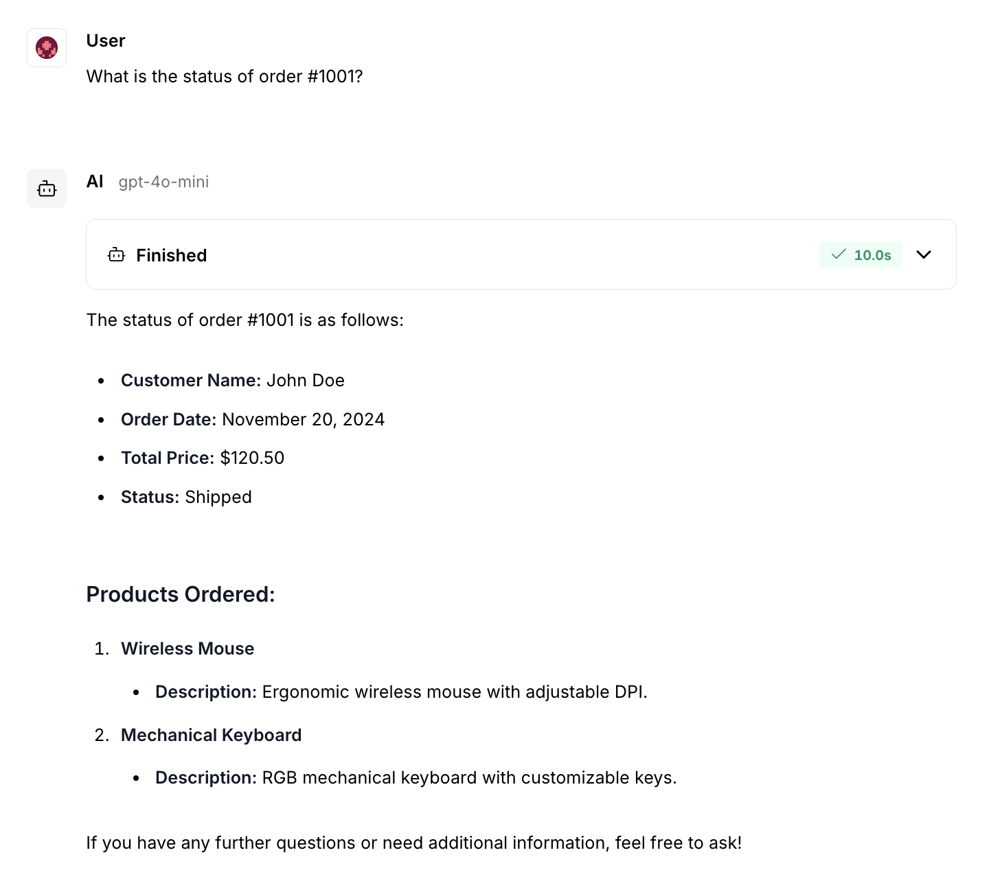

---

#### **Conduct Comprehensive Testing** ✅  
- **Test Point 1:** Ensure responses match the data in the `Orders` and `Products` collections. 📋  
- **Test Point 2:** Run mixed queries to validate task routing, such as:  
   ```
   How can I cancel order #1001 and what is the shipping policy?
   ```  
   Confirm the agent combines multiple tools to provide aggregated responses. 🔄

---

> **🎉 Congratulations!** Your `ManagementAgent` now seamlessly integrates the RAG and Order Lookup flows, enabling your system to handle complex, multi-faceted queries with ease.

---

### Step 9: **Integrate with a Python Front End** 🖥️🐍

Create a user-friendly interface using Streamlit to connect your Langflow-powered backend with end users seamlessly.

---

#### **Fork the Repository** 🍴  
- Visit [Agentic AI Workshop](https://github.com/difli/agentic-ai-workshop).  
- Click **Fork** in the top-right corner of the GitHub page.  

   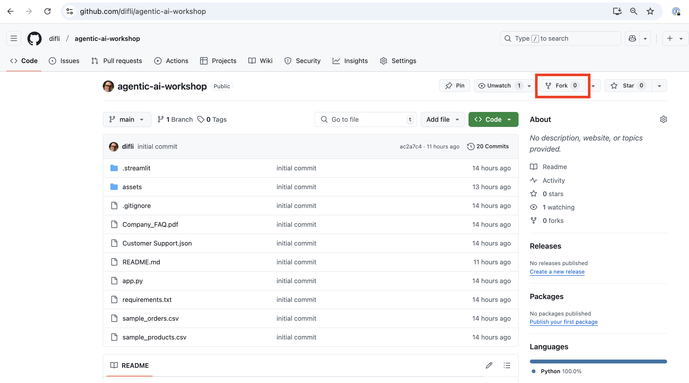

---

#### **Clone the Repository** 📁  
- Clone the forked repository to your local machine:  
   ```bash
   git clone https://github.com/YOUR_GITHUB_USERNAME/agentic-ai-workshop.git
   cd agentic-ai-workshop
   ```

---

#### **Set Up a Virtual Environment** 🐍  
- Create and activate a Python virtual environment:  
   ```bash
   python3 -m venv venv
   ```
   - **On Linux/Mac:**  
     ```bash
     source venv/bin/activate
     ```
   - **On Windows:**  
     ```bash
     venv\Scripts\activate.bat
     ```

---

#### **Install Dependencies** 📦  
- Install the required Python packages:  
   ```bash
   pip install -r ./requirements.txt
   ```

---

#### **Configure Secrets** 🔑  
- Copy and edit the example secrets file:  
   ```bash
   cp .streamlit/secrets.toml.example .streamlit/secrets.toml
   ```
---

#### **Retrieve Langflow Credentials** 🔐  

- Log in to Langflow, click **API**.

   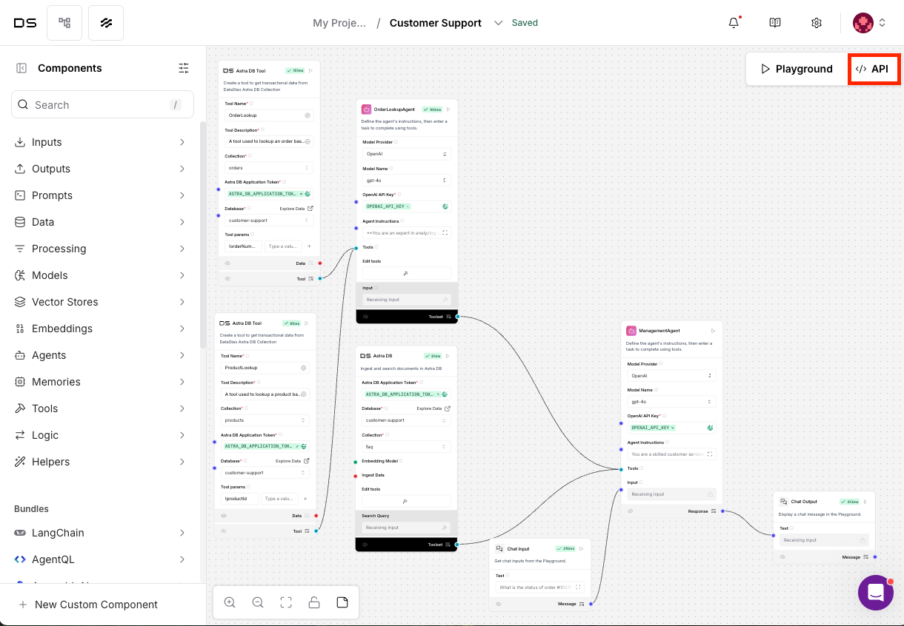

- Click **Generate Token**.  

   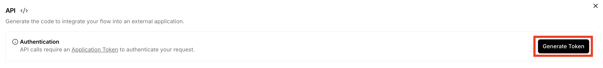
  
- Click the **copy icon** on the right-hand side. Paste the token into your `secrets.toml`.  

   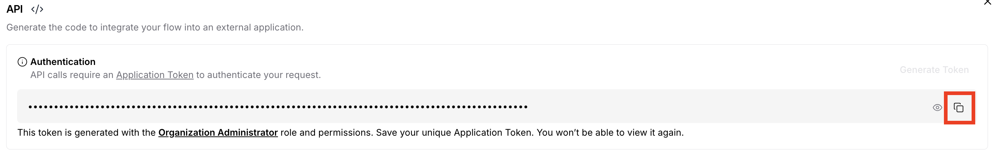
  
- Copy your **Langflow ID** from the curl command and paste it into your `secrets.toml`.  

   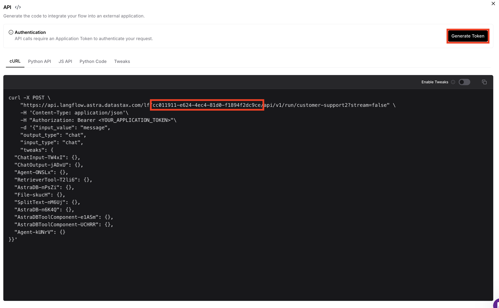

- Click **Flow Settings** to see the **Endpoint Name** you have configured for the flow at the start of the workshop.  

   

- Copy the **Endpoint Name** and paste it into your `secrets.toml`.  

   

- Your `secrets.toml` file should now contain your credentials:  
   ```plaintext
   APP_TOKEN="AstraCS:LKeBuZvesCUlokSbiNfjCvAG:e291f0b1f37925cb31565d859bc56ec25cc1371..."
   LANGFLOW_ID="cc011911-e624-4ec4-81d0-f1894f2..."
   ENDPOINT="customer-support"   
   ```
---

#### **Run the Application** ▶️  
- Start the Streamlit server:  
   ```bash
   streamlit run app.py
   ```

---

#### **Test the Front End** 💬  
- Open the app in your browser (`http://localhost:8501`).  
- Try sample questions or queries like:
   - "How can I track my order?"
   - "What is your return policy?"
   - "Can I cancel order #1004?"

   

---

#### Understand How `app.py` Works 📝  
The `app.py` file connects the Streamlit front end with the Langflow backend.  
Key features include:
- **API Integration:** The `run_flow()` function sends queries to Langflow and retrieves responses.  
- **User Interface:** Designed with Streamlit to offer a simple and intuitive experience.  

For a detailed walkthrough of `app.py`, see [Understanding app.py](#appendix-understanding-apppy-).

---

> **🎉 Success!** Your Streamlit front end is up and running, offering an intuitive and professional way for users to interact with your AI-powered customer support system.

---

### Step 10: **Deploy the Application to Streamlit Cloud** 🌐☁️

Now that your application is running locally, let’s deploy it to **Streamlit Cloud** for easy access and sharing. Streamlit Cloud allows you to host your application directly from your GitHub repository.

---

#### Prepare Your Repository 📁  
Push any local changes to your forked repository:
```bash
git add .
git commit -m "Prepare for Streamlit Cloud deployment"
git push origin main
```

---

#### Log In to Streamlit Cloud 🌐  
- Visit [Streamlit Cloud](https://streamlit.io) and log in using your **GitHub** credentials.

---

#### Create a New Deployment 🚀  
- On the Streamlit Cloud dashboard, click **Create App**.  
  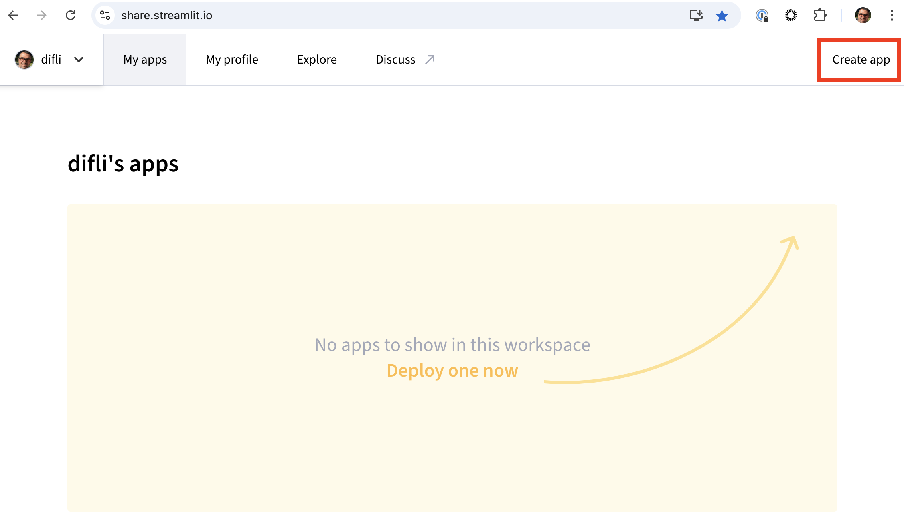

- Fill in the details, specifying your forked GitHub repository. Choose the branch (e.g., `main`) and `app.py` as the entry point.  
  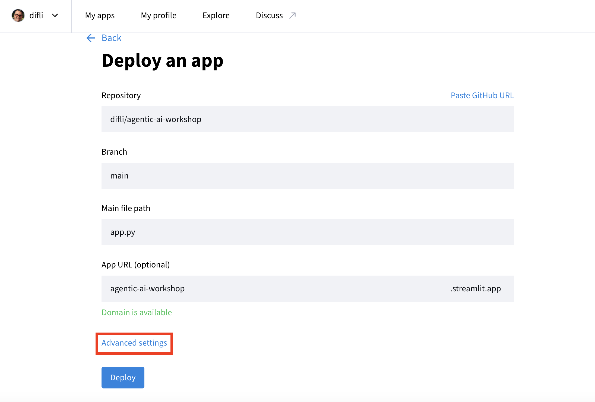

---

#### Set Up Secrets 🔑  
- Go to the **Advanced Settings** section and locate the **Secrets** tab.  
- Copy the contents of your local `secrets.toml` file and paste them into the **Secrets Editor**. Include:  
  ```plaintext
  LANGFLOW_ID = "Your_Langflow_ID"
  ENDPOINT = "Your_Langflow_Endpoint"
  APP_TOKEN = "Your_Application_Token"
  ```  
  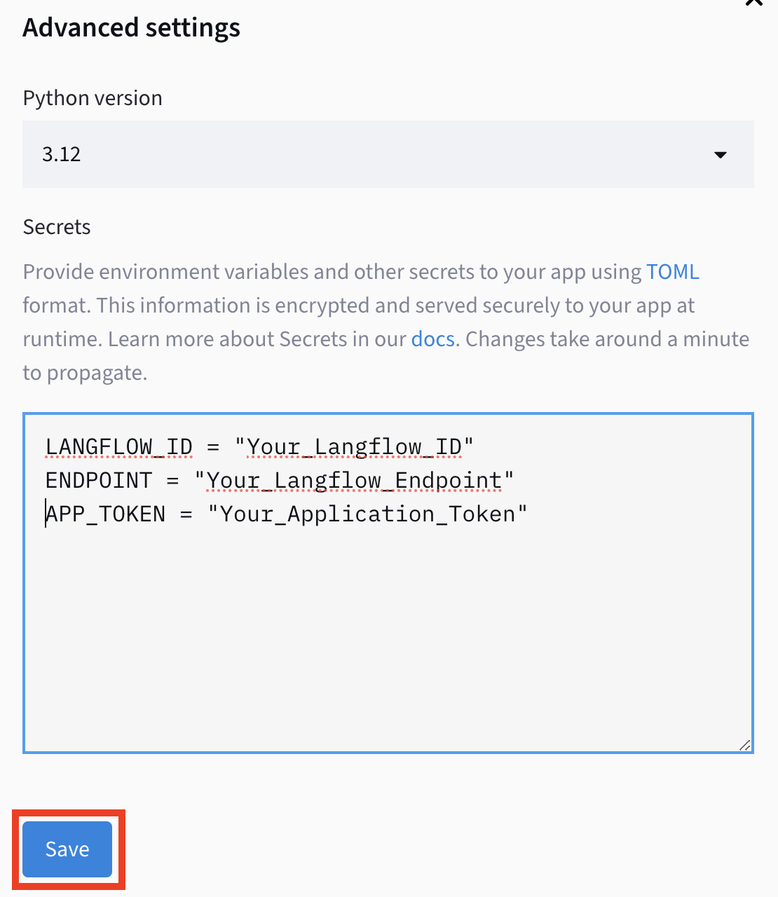

---

#### Deploy the Application ▶️  
- Click **Deploy** and wait for the build process to complete. Streamlit will notify you when the app is live.

---

#### Access and Test Your Application 🌍  
- Your app will be accessible via a unique URL (e.g., `https://agentic-ai-workshop.streamlit.app`).  
- Open the app in your browser and test it by:
  - Trying sample questions like:
    - "How can I track my order?"
    - "What is your return policy?"
  - Using custom queries such as:
    - "Can I cancel order #1001 and what is the shipping policy?"  
  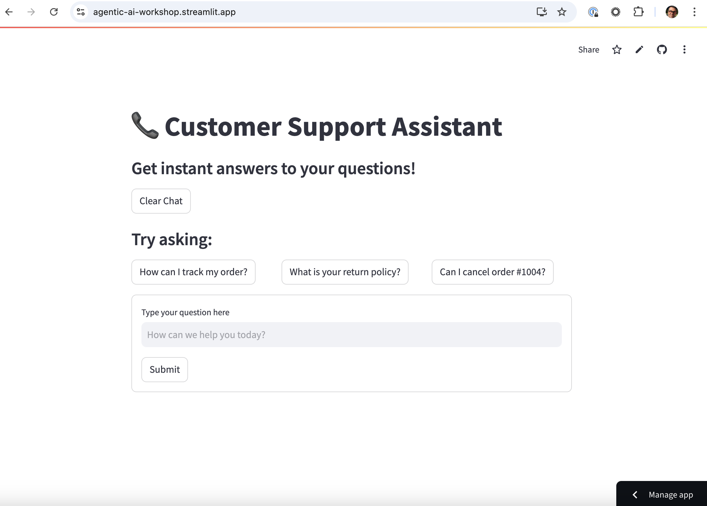

---

#### Manage Your Deployment 🔄  
- Use the Streamlit Cloud dashboard to:
  - Monitor app usage.
  - Update the app by pushing changes to your GitHub repository.
  - Redeploy as needed.

---

> **🎉 Success!** Your AI-powered application is now live on Streamlit Cloud, ready to deliver real-time customer support solutions to users anywhere in the world.

---

## Resources 📚🔗

- 📖 **Langflow Documentation:** [Langflow Docs](https://docs.datastax.com/en/langflow/index.html)  
- 🛠️ **Astra DB Documentation:** [Astra DB Docs](https://docs.datastax.com/en/astra-db-serverless/index.html)  
- 💾 **GitHub Repository:** [Workshop Content](https://github.com/difli/agentic-ai-workshop.git)

---

## Call to Action 🚀✨

🎉 Congratulations on building a cutting-edge AI system! Expand your skills further by exploring new use cases like inventory management, knowledge retrieval, or personalized recommendations. Let's innovate! 🚀

🤔 **What will you build next?** The tools are in your hands. 💡🌟

---

## Appendix: Understanding `app.py` 📝

The `app.py` file serves as the backbone of your application, connecting the **Streamlit** front end with the **Langflow-powered backend**. Here's a breakdown of its key components:

---

### **API Integration**

The `run_flow()` function is responsible for communicating with the Langflow backend:
- **Base API URL**: Retrieved from the `secrets.toml` file (`LANGFLOW_ID`, `ENDPOINT`, and `APP_TOKEN`).
- **Payload**: Sends user input to the backend in JSON format.
- **Response Handling**: Extracts the AI-generated response for display in the UI.

Code Snippet:
```python
def run_flow(message: str) -> dict:
    api_url = f"{BASE_API_URL}/lf/{LANGFLOW_ID}/api/v1/run/{ENDPOINT}"

    payload = {
        "input_value": message,
        "output_type": "chat",
        "input_type": "chat",
    }

    headers = {"Authorization": "Bearer " + APPLICATION_TOKEN, "Content-Type": "application/json"}
    response = requests.post(api_url, json=payload, headers=headers)
    return response.json()
```

---

### **Streamlit Front End**

The Streamlit front end provides an intuitive interface for user interactions:
- **Chat Input and Output**: Users submit queries, and AI responses are displayed as styled chat bubbles.
- **Sample Questions**: Buttons provide quick access to predefined queries.
- **Custom Styling**: CSS enhances the visual appeal of the chat interface.

Code Snippet (Input and Response Handling):
```python
# Display chat history
for message in st.session_state["messages"]:
    # User's message
    st.markdown(f'<div class="chat-bubble-user">{message["user"]}</div>', unsafe_allow_html=True)
    # Bot's response
    st.markdown(f'<div class="chat-bubble">{message["bot"]}</div>', unsafe_allow_html=True)
```

---

### **Custom Styling**

Custom CSS styles ensure the app is visually appealing and user-friendly. Example:
```css
.chat-bubble {
    background-color: #007bff;
    color: white;
    padding: 10px;
    border-radius: 15px;
}
```

---

### **Secrets Management**

The `secrets.toml` file stores sensitive credentials:
- **Langflow ID**: Identifies the specific flow to connect.
- **Application Token**: Authenticates API requests.
- **Endpoint**: Specifies the Langflow backend entry point.

---

### **How It All Comes Together**

The app performs these key steps:
1. Users submit a query via the Streamlit interface.
2. The query is sent to Langflow through the `run_flow()` function.
3. Langflow processes the query using your custom flow and returns a response.
4. The response is displayed in the Streamlit UI, styled as chat bubbles.

---

By understanding `app.py`, you can:
- Customize its functionality for your specific use case.
- Add more features, like new buttons or additional styling.

> **Next Steps:** Experiment with `app.py` to expand your app's capabilities!
